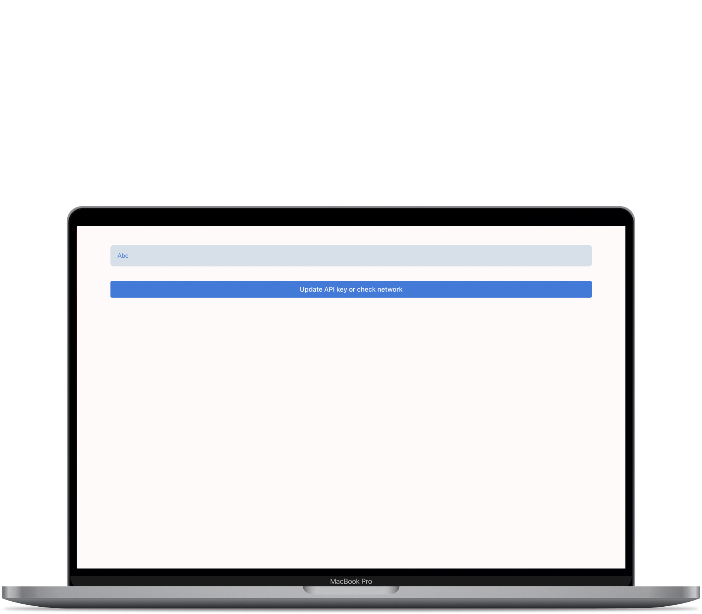
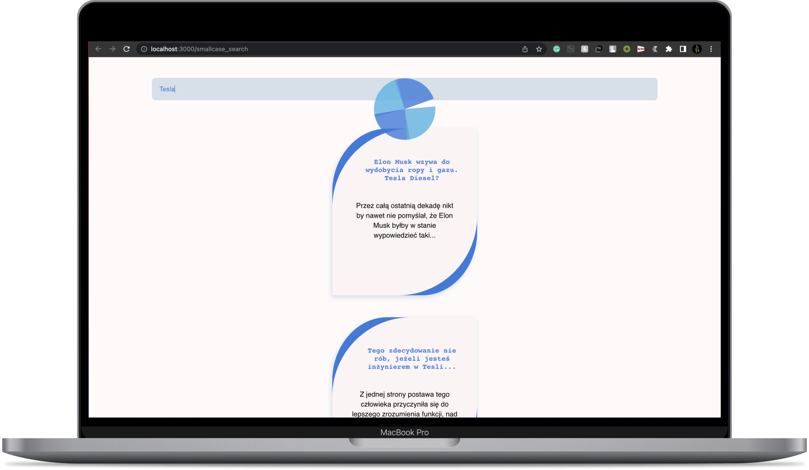
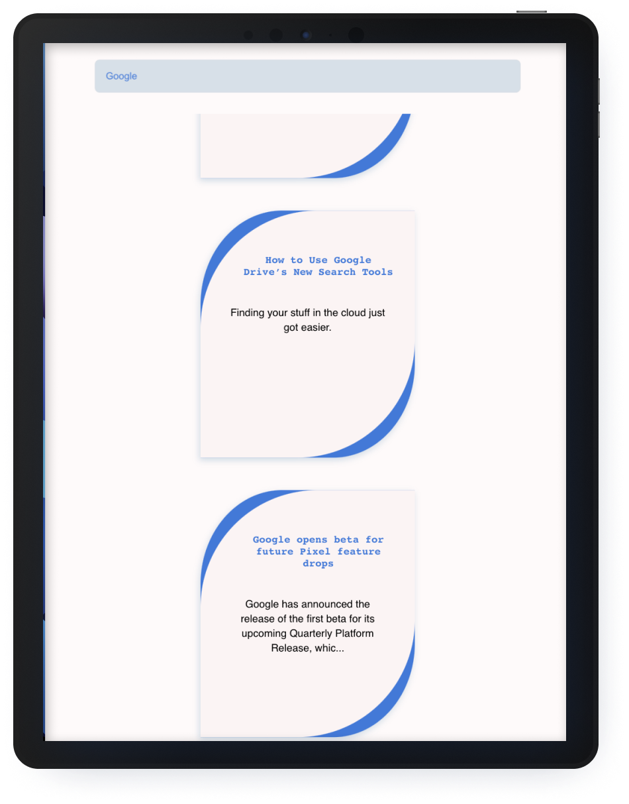

# News Keyword Search Application

Enter a Keyword to search for news articles from different sources related to that query in the recent days.

## Objectives

> Waiting for user to stop typing and prevent sending requests on intermediate states.

```JavaScript
          clearTimeout(this.timer);
          const newTimer = setTimeout(() => {
            this.checkCacheOrFetch(currentinput);
          }, 1000);
          this.setState({ ...this.state, timer: newTimer, errmsg: "" });
```

We do not call the fetch function untill it's been a second since user pressed a key.

> Not allowing any requests for serach quueries shorter than two characters

```JavaScript
      this.setState({
        ...this.state,
        query: currentinput,
        loading: false,
        errmsg: "Search Query Should be atleast 3 Characters long",
        results: {},
        pageNo: 1,
      });
```

## Showing Proper error messages, when needed



> Responsiveness

---





> Other Specifications include

1. Caching
2. Cancelling Previous Queries
3. CSS transitions on hovering
4. Paginations

## Available Scripts

To run the project directory, you can run:

### `npm i` followed by `npm start`

Runs the app in the development mode.\
Open [http://localhost:3000](http://localhost:3000) to view it in the browser.

The page will reload if you make edits.\
You will also see any lint errors in the console.

### `npm run build`

Builds the app for production to the `build` folder.\
It correctly bundles React in production mode and optimizes the build for the best performance.

### `npm run eject`

**Note: this is a one-way operation. Once you `eject`, you can’t go back!**

[Armaan Jain](https://armaanjain.tech)
